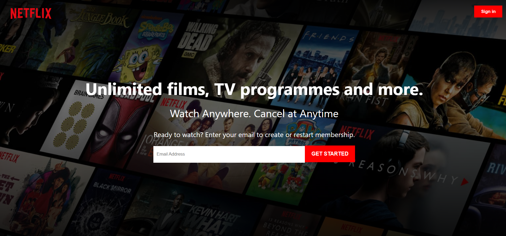
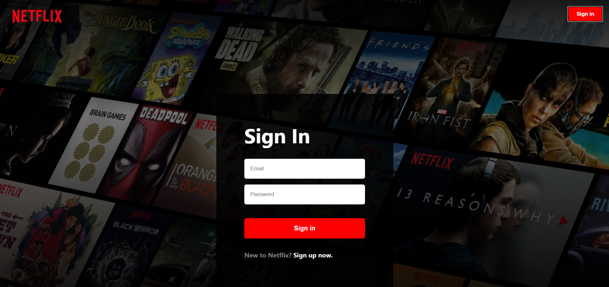
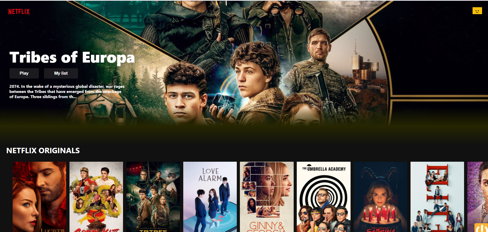
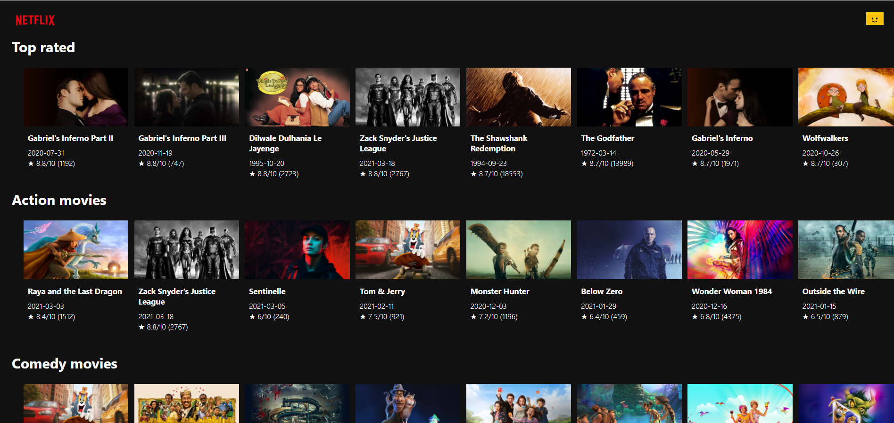
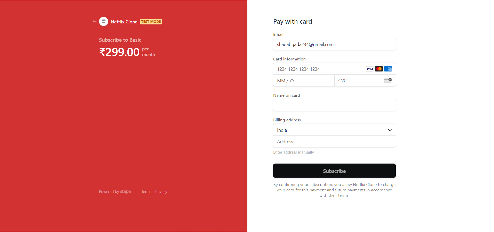
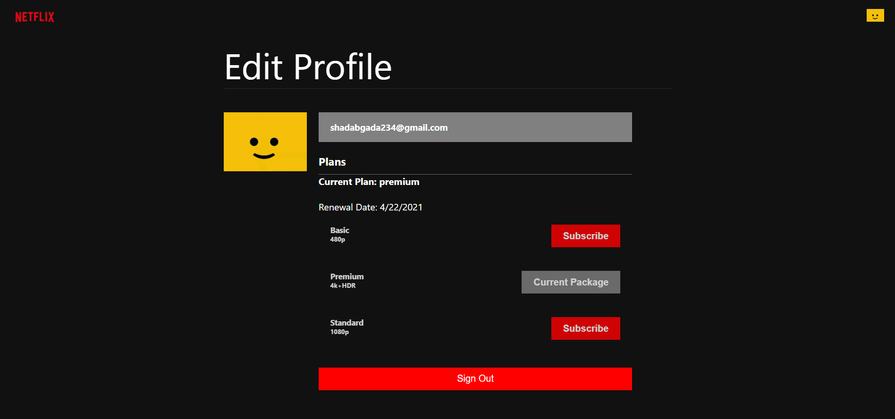

### Project is deployed on Firebase
#### Click to view <a href="https://netflix-clone-8616e.web.app/">LIVE DEMO</a>

 

### Steps to deploy
1. `firebase login`
2. `firabase init`
3. use space to select further options
4. enter public directory name as `build` (without quotes)
5. <b>build the project</b>: `npm run build`
6. `firebase deploy`

 

## Screenshots:

 

Landing Page

 

Sign In page

 

Home page

 

Home page

 

Payment page

 

Profile page

